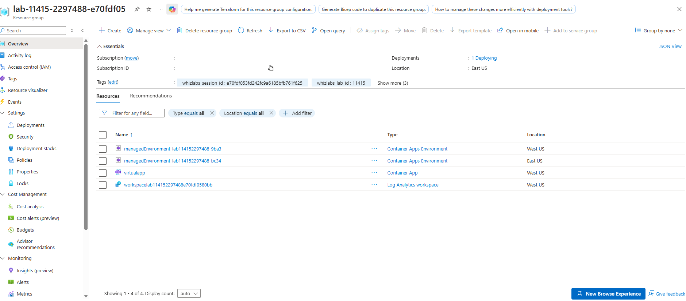
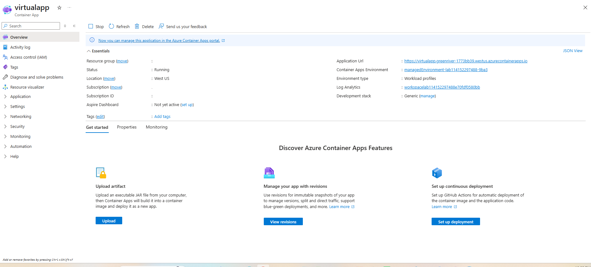
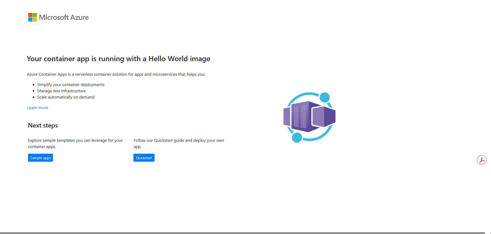

# Azure Container Apps: Serverless Container Deployment

## Lab Overview
This project demonstrates the deployment and configuration of a serverless containerized web application using **Azure Container Apps**. The deployment includes provisioning a Log Analytics Workspace for centralized observability, setting up a Container Apps Managed Environment, and deploying a containerized image configured with public HTTP ingress.

---

## Lab Objectives
* Provision a Log Analytics Workspace for operational monitoring and log aggregation.
* Create an Azure Container Apps Managed Environment.
* Deploy a serverless container application running a quickstart web container.
* Configure external HTTP ingress and target port settings.
* Verify public connectivity via the generated Container App application URL.

---

## Architecture & Configuration Details

* **Primary Region:** West US
* **Container App Name:** `virtualapp`
* **Container Image:** `mcr.microsoft.com/k8se/quickstart:latest`
* **Allocated Compute:** 0.25 vCPU, 0.5 GiB Memory
* **Ingress:** External (Accepting traffic from anywhere on Target Port 80)
* **Application URL:** `https://virtualapp.greenriver-1773bb39.westus.azurecontainerapps.io`
* **Log Analytics Workspace:** `workspacelab114152297488e70fdf0580bb`

| Resource Name | Type | Region | Purpose |
| :--- | :--- | :--- | :--- |
| **virtualapp** | `Microsoft.App/containerapps` | West US | Serverless microservice host running the container |
| **managedEnvironment-lab114152297488-9ba3** | `Microsoft.App/managedEnvironments` | West US | Secure boundary & shared infrastructure for apps |
| **workspacelab114152297488e70fdf0580bb** | `Microsoft.OperationalInsights/workspaces` | West US | Log ingestion, container console, and system logs |

---

## Lab Verification & Screenshots

### 1. Resource Group Inventory
Confirmation of all provisioned services, including the Container Apps environments, Log Analytics workspace, and the container app itself:

---

### 2. Container App Status & Ingress
The container application (`virtualapp`) successfully provisioned in the `Running` state within the West US environment, displaying its unique external ingress URL:

---

### 3. Application Verification
Accessing the external endpoint directly via web browser confirms that the Hello World container application is successfully accepting and responding to public traffic:

